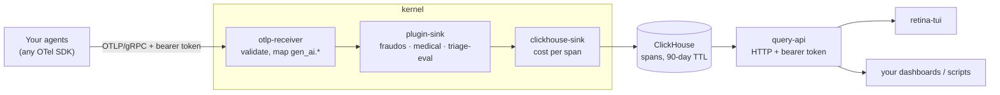
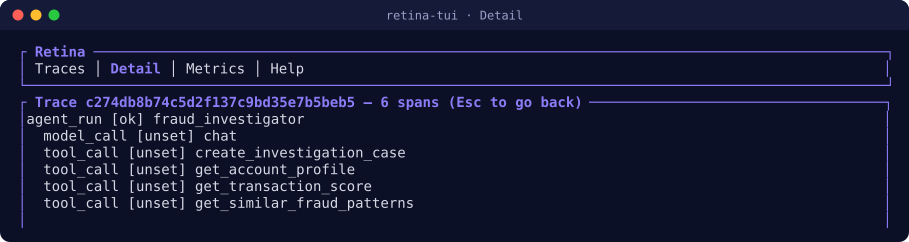
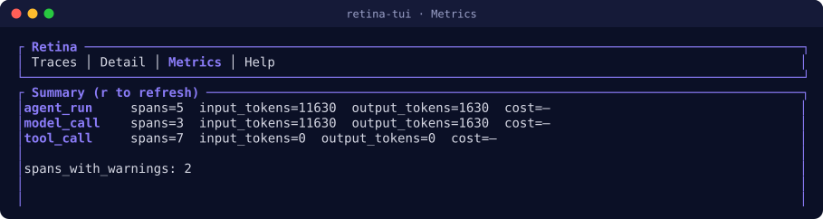

<p align="center"></p>

<h1 align="center">Retina</h1>

<p align="center"><strong>Observability for LLM agents that checks the rules, not just the tokens.</strong></p>

<p align="center">
  <a href="https://github.com/retelabs/retina/actions/workflows/ci.yml"></a>
  <a href="LICENSE"></a>
  
</p>

When an AI agent makes a decision, a trace tells you which model it called and how many tokens
it used. It does not tell you whether the decision respected the rules of the business it
serves. Retina does both: it ingests standard OpenTelemetry traces from your agents, stores them
in ClickHouse, and runs **domain plugins** that check governance invariants on every span, as it
arrives.

## What it does

- **Standard in.** OTLP/gRPC ingestion, aligned on the OpenTelemetry GenAI semantic conventions,
  pinned to an exact version. Any OTel SDK works: no custom client code.
- **Domain plugins on every span.** Plugins read the attributes your application already sets and
  flag what breaks the rules (see [Plugins](#plugins)). Warnings are stored with the span and
  counted in the metrics.
- **Cost per span.** Computed once at ingestion from a price table checked against the providers'
  official pages. A span with incomplete usage is left unpriced rather than given a wrong number.
- **Storage and queries.** ClickHouse with a 90-day retention TTL, a small authenticated query
  API, and a terminal UI.
- **Self-hostable.** Docker Compose for local and production, TLS through Caddy, three isolated
  network zones (edge, app, data), and an optional home-made control plane with an HTTP API.

## Architecture



## Plugins

Plugins are native Rust (WASM loading was explored and deferred, see
[ADR 0004](docs/adr/0004-native-plugin-loading.md)), enabled with `ENABLED_PLUGINS`. Each is a
no-op on spans of other verticals.

| Plugin | Reads | Flags |
|---|---|---|
| `fraudos-plugin` | `fraudos.final_decision`, `fraudos.transaction_id` | A consequential decision (`CONFIRMED_FRAUD`, `REQUEST_BLOCK`, ...) with no transaction id to reconcile it with the real outcome later. Derives `fraudos.requires_urgent_review`. |
| `medical-plugin` | `oncology.current_step`, `hipaa_cleared`, `gdpr_cleared`, `approved_by` | A compliance gate that failed while the pipeline kept going; a clinical recommendation reached with no human sign-off. Derives `oncology.awaiting_approval`. |
| `triage-eval-plugin` | `oncology.triage.tag` | A triage tag that drifted away from the real service list (`TRIAGE_KNOWN_SERVICES`). Derives `eval.triage.tag_known`. |

The rules come from reading the code of two real agent pipelines (a fraud investigation agent on
Bedrock and an oncology LangGraph pipeline), not from invented examples:
[docs/interfaces/oncology-governance.md](docs/interfaces/oncology-governance.md),
[docs/interfaces/plugin-contract-v0.md](docs/interfaces/plugin-contract-v0.md).

## Quick start

Requirements: Docker with Compose, and Rust for the replays and the terminal UI.

```bash
scripts/dev-stack.sh up      # ClickHouse + kernel (:4317) + query-api (:8080), dev tokens
scripts/demo.sh              # replays two realistic fraud-investigation runs, then queries them
```

The dev stack uses fixed tokens (`dev-kernel-key`, `dev-query-key`); production generates real
ones with `scripts/gen-secrets.sh` (see `docker/docker-compose.prod.yml`).

Point your own agent at it with the standard OpenTelemetry variables:

```bash
export OTEL_EXPORTER_OTLP_ENDPOINT=http://localhost:4317
export OTEL_EXPORTER_OTLP_HEADERS="authorization=Bearer dev-kernel-key"
```

Spans are dispatched on `gen_ai.operation.name` (`chat`, `execute_tool`, `invoke_agent`, ...). The
[client integration guide](docs/client-integration.md) lists the attributes each event type
uses, the plugin attributes, and the three query endpoints.

## Terminal UI

```bash
QUERY_API_URL=http://localhost:8080 QUERY_API_KEY=dev-query-key cargo run -p tui
```

<p align="center"></p>
<p align="center"></p>

`Tab` switches view (Traces, Detail, Metrics, Help), `↑`/`↓` selects a trace, `Enter` opens it,
`r` refreshes, `q` quits. The captures above come from the real TUI, against replayed fixtures.

## Status

An early MVP, built in the open from a [design dossier](design-dossier.md) and recorded
decisions ([docs/adr/](docs/adr/)). What it deliberately does not do yet:

- traces only: OTLP metrics and logs are not ingested;
- single tenant (one set of tokens per surface, [ADR 0001](docs/adr/0001-multi-tenant-out-of-mvp-scope.md));
- one ClickHouse instance, no high availability;
- one synchronous insert per OTLP export, no buffering yet;
- prompt and response content are not captured (the GenAI PII default).

## How it is built

Every boundary with an external spec (OTLP, the GenAI conventions, ClickHouse, Docker, Caddy) has
a contract sheet in [docs/interfaces/](docs/interfaces/), written from the real documentation
before the code. The external specs are vendored and pinned (`scripts/check-pins.sh`).

```bash
cargo fmt --check && cargo clippy --workspace --all-targets -- -D warnings
cargo test --workspace
scripts/test-integration.sh [--with-docker]   # every integration test, from scratch
```

The integration script starts a throwaway ClickHouse at the pinned version, a real kernel and
query-api, and replays the fixtures; CI runs it on every pull request.

## Part of retelabs

Retina is a [retelabs](https://github.com/retelabs) project, next to
[Cairn](https://github.com/Cairn-DB/cairn), hybrid search where a deletion is final.

## Licence

Apache-2.0, see [LICENSE](LICENSE) and [NOTICE](NOTICE).
